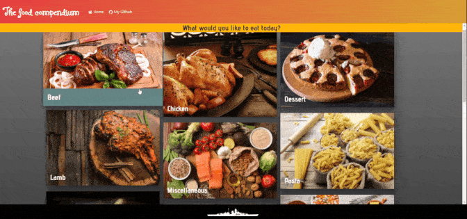

# The Food Compendium

> React Project where I developed a recipe finder/swiper. The app depends on TheMealDB.com API to populate Categories, Meals, steps and ingredients. 
## Screenshots:

Desktop             |  Mobile
:-------------------------:|:-------------------------:
  |  


## Video Explanation:

#### [Video explaining the project - Youtube](https://youtu.be/FMTrePHolbs)

## Live Demo:

#### [The Food Compendium - REACT - deployed in GitHubPages - Click Here](https://bismarck-gm.github.io/the-food-compendium/)

## Built With

- JavaScript (ES6)
- React.JS
- Redux
- Thunk
- Axios
- React-router
- Node.js
- prop-types
- Chakra-UI
- Jest
- React Testing Library

## Getting Started

### Prerequisites

- Node.js
- Any Browser

To get started open the directory where you will save this repo by typing on your terminal:

```
$ cd <directory>
```

- Clone the repo typing:

```
$ git clone git@github.com:Bismarck-GM/the-food-compendium.git
```

- Install dependencies:

After cloning move into the recently created folder (the-food-compendium) and run

```
$ npm install
```

### Usage

Start the React server:

```
$ npm start
```

A new browser tab/window will open up after the server is initiated.

Redux Toolkit options are running. You can check the Actions by using Redux DevTools in Chrome/Firefox.
### Testing

To run the test simply run:

```
$ npm run test
```
## Author

👤 **Gerónimo Morisot**

- Github: [@Bismarck-GM](https://github.com/Bismarck-GM)
- Twitter: [@Rewritablee](https://twitter.com/Rewritablee)
- LinkedIn: [Geronimo Morisot](https://linkedin.com/in/geronimomorisot)

## 🤝 Contributing

Contributions, issues and feature requests are welcome!

## Show your support

Give a ⭐️ if you like this project!
Feel free to check the [issues page](issues/).

## 📝 License

This project is [MIT](lic.url) licensed.